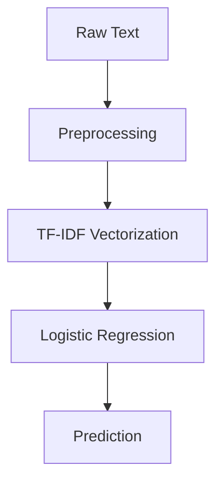
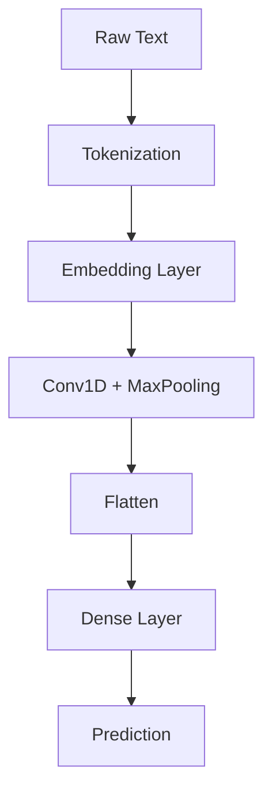
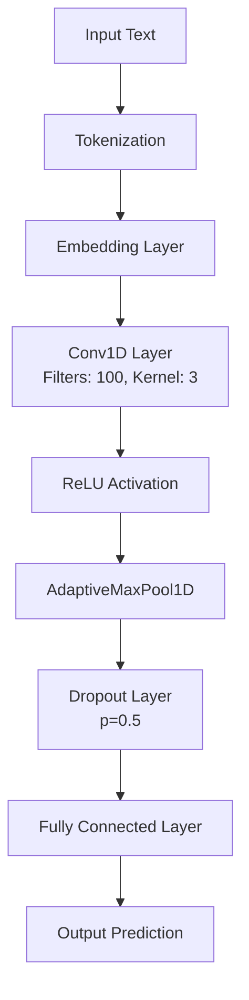
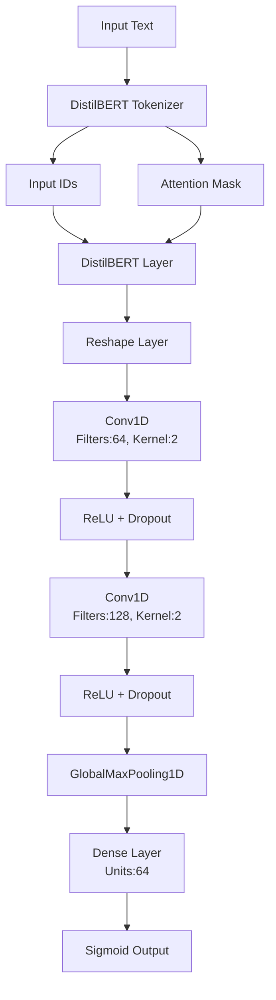
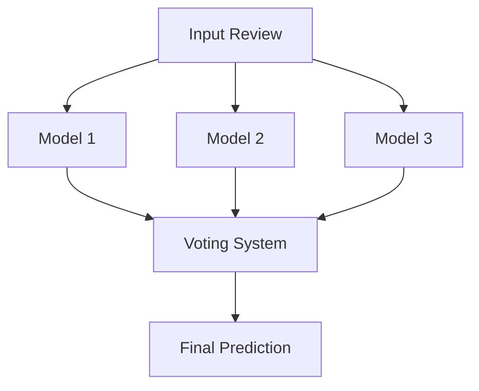

# 🍽️ Restaurant Review Sentiment Analysis with Ensemble Learning

A robust sentiment analysis system that classifies restaurant reviews as positive or negative using an ensemble of machine learning and deep learning models.

[Live Demo](https://sultanmr-sentimental-analysis-app-941vjx.streamlit.app/)


## 🌟 Key Features

- **Multi-Model Ensemble** combining:
  - 📊 Traditional ML (TF-IDF + Logistic Regression/SVM)
  - 🧠 Keras-based CNN
  - 🔥 PyTorch-based CNN
  - 🗳️ **Voting System** (hard and soft voting options)
  - 📈 Comprehensive performance metrics
  - 🛠️ Modular architecture for easy extension

## 📊 Performance Comparison

| Model                     | Accuracy | F1-Score | Training Time |
|---------------------------|----------|----------|---------------|
| Logistic Regression       | 0.81     | 0.81     | 30s           |
| Keras CNN                 | 0.71     | 0.84     | 2min          |
| PyTorch CNN               | 0.86     | 0.85     | 3min          |
| Customize Bert            | 0.89     | 0.84     | 2min          |
| Hugginface Transformer    | 0.94     | 0.85     | 0min          |
| **Ensemble (Voting)**     | **0.88** | **0.87** | -             |

## 🚀 Quick Start

### Prerequisites
- Python 3.8+
- pip package manager

### Installation

```bash
git clone https://github.com/sultanmr/sentimental-analysis.git
cdsentimental-analysis
python -m venv venv
source venv/bin/activate  # On Windows: venv\Scripts\activate
pip install -r requirements.txt
```

### Running the Application

```bash
# Train all models and evaluate performance
python main.py

# Launch interactive demo (requires Streamlit)
streamlit run app.py

# View models performance and confusion matrix (requires Tensorboard)
tensorboard --logdir logs
```
## 🏗️ Project Structure

```
restaurant-sentiment-analysis/
│
├── logs/                    # Tensorboard logs for accuracy, loss and confusion matrix
├── models/                  # Model implementations code
├── save/                    # Models pickle files
├── app.py                   # Streamlit web application
├── main.py                  # Training models
├── testm.py                 # Model testing
├── tb_utils.py              # Tensorbaord wrapper file
├── requirements.txt         # Dependencies
├── config.yaml              # Online learned models path
└── README.md                # This file
```

## 📚 Dataset

The dataset contains 1000 restaurant reviews with binary sentiment labels:

| Column   | Description                          |
|----------|--------------------------------------|
| Review   | Text of customer review              |
| Liked    | Sentiment label (1=Positive, 0=Negative) |

**Download:** [Restaurant_Reviews.tsv](https://www.dropbox.com/scl/fi/6mvhmvbuyijpt5rwzk12o/Restaurant_Reviews.tsv?rlkey=31dhfnze1subkcsdoa50irtvc&st=77nhe6hr&dl=1)

## 🧠 Model Architecture

### 1. Traditional Machine Learning


### 2. Keras CNN


### 3. PyTorch CNN

### 4. Custom BERT Architecture


### 5. Ensemble Voting


## 📊 Results Visualization


## 🛠️ Customization

### Training Configuration
Edit `.env` to modify:
- Model training local path
- CSV Path
- Training epochs
Edit `config.yaml` to modify:
- Model online URL

### Adding New Models
1. Create new model file in `models/` directory
2. Implement required interface:
   ```python
   def train(X_train, y_train)
   def predict(X_test)
   ```
3. Register model in `main.py` and config.yaml

## 📜 License

This project is licensed under the MIT License - see the [LICENSE](LICENSE) file for details.


## ✉️ Contact

For questions or suggestions, please contact:
- [Sultan](mailto:sultanmr@hotmail.com)
- [Project Website](https://www.sultanmahmood.com)

---

<div align="center">
  Made with ❤️ using Python, TensorFlow, and PyTorch
</div>
```

Key improvements:
1. Add voice to text features for testing purposes
2. Add multilingual options
3. Added performance comparison table
4. Included customization instructions

